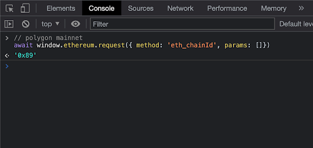
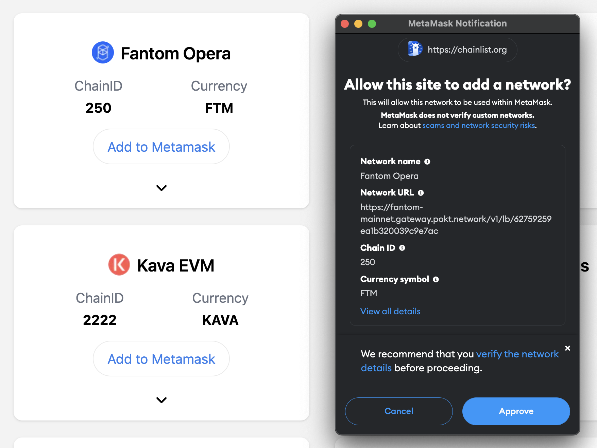
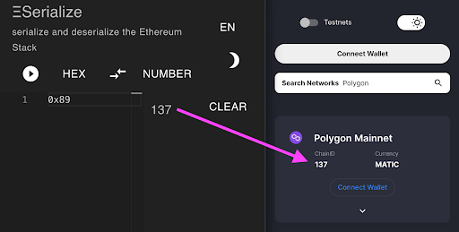
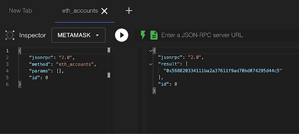
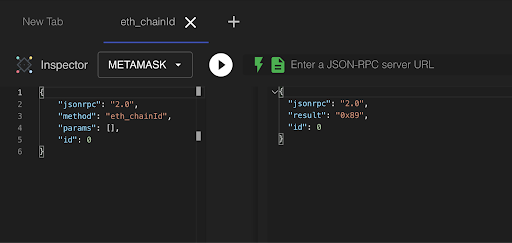
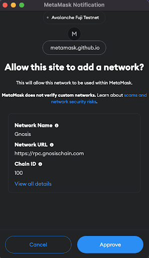
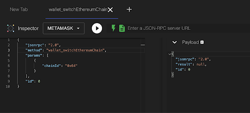
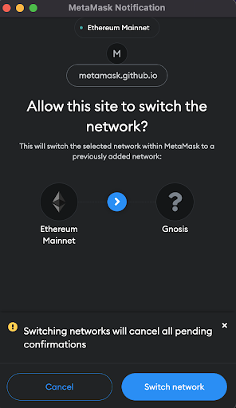

# Introduction to the MetaMask dApp API

If you are planning to integrate authentication and identity into your Web3 applications, getting acclimated with the MetaMask API is a great way to start learning the capabilities afforded to you working with the MetaMask Extension and learning your way around the Web3 stack in general.

## TOC

- [What is the MetaMask API?](#what-is-the-metamask-api)  
- [What is JSON RPC?](#what-is-json-rpc)  
- [Essential Tools](#essential-tools)  
  - [Ethereum Provider](#ethereum-provider)  
  - [MetaMask RPC API](#metamask-rpc-api)
  - [MetaMask API Playground](#metamask-api-playground)  
  - [Chainlist](#chainlist)
  - [Eserialize](#eserialize)
- [Examples of Usage](#examples-of-usage)  
- [Connecting to MetaMask Mobile with SDK](#connecting-to-metamask-mobile-with-sdk)
- [Smart Contract Example](#smart-contract-example)

This information within expands on my [fifteen minute talk from Chainlink SmartCon 2022](https://www.youtube.com/watch?v=cMZkwMs_8i4) conference in New York City. The purpose of this article is to get you ramped up with using the MetaMask API as quickly as possible and is an estimated 15 minute read.

## What is the MetaMask API?

Whenever we use a browser like Chrome, Firefox, or Brave and a wallet extension like MetaMask is installed, we can use the Ethereum provider (as specified by [EIP-1193](https://eips.ethereum.org/EIPS/eip-1193)) injected into the browser page at `window.ethereum`. Historically, Provider implementations exhibit conflicting interfaces and behaviors between wallets. This EIP formalizes an Ethereum Provider API to promote wallet interoperability.

We use this provider with our dapp to request users’ Ethereum accounts, read on-chain data and have the user sign messages and transactions.

MetaMask API calls are defined with the JSON-RPC specs that [we will explain further](#what-is-json-rpc).

We can tell in the developer tools when MetaMask is installed and enabled through the developer tools, using chrome you can look into the Sources/Page, and you will see an icon that represents MetaMask.


Page is used for viewing available resources on the current webpage. 
Under the Top level, we see the representation of the main document and all of its resources.

If we see MetaMask represented by a cloud icon here, we know that the MetaMask is installed and not disabled.

The `window.ethereum` object is being injected into the page, allowing us to interact with MetaMask and Ethereum.

We can directly access and call the `window.ethereum` object in our developer tools console. Let’s say that we wanted to get the current chainId.



By running the code above in our console, and if we are currently connected to Polygon, we would see ‘0x89’ returned from this method call.

As you get started with using MetaMask API methods, you might want to check out some of our [beginner-level videos](https://www.youtube.com/watch?v=03lbmYrawV8) from our Lead DX Engineer [Gui Bibeau](https://twitter.com/guibibeau) that can help get you started working with the MetaMask API.

## What is JSON RPC?

JSON-RPC is a transport agnostic RPC that uses the JSON data format. When communicating with a JSON-RPC server you’re sending light-weight JSON despite how that server was built or with what language or platform is was built on. It's designed to be simple and is relatively simple to learn with the right tools.

This is convenient as it means no matter if we send over HTTP or Web Sockets, we are always sending JSON which is approachable to all developers.

JSON RPC IMHO, is a really important technology to learn about when first getting into Web3 and learning to build on the Dapp layer, a few other technologies I think you should be familiar with are:

- [JavaScript](https://www.udemy.com/courses/search/?src=ukw&q=javascript) and [TypeScript](https://www.typescriptlang.org/docs/handbook/typescript-from-scratch.html)
- having a good understanding of existing Web2 concepts
- Smart Contracts ([Solidity](https://docs.soliditylang.org/))

You can learn more about the JSON RPC specification at [jsonrpc.org/specification](jsonrpc.org/specification)

## A JSON RPC Request and Response Example

Here we have a typical request and response in JSON format. The first example uses the `eth_chainId` RPC API method outlined in [EIP-695](https://eips.ethereum.org/EIPS/eip-695) which returns a single **STRING** result for an integer value in **hexadecimal** format, describing the currently configured `CHAIN_ID` value used for signing replay-protected transactions, introduced by [EIP-155](https://eips.ethereum.org/EIPS/eip-155).

### Request

We call the [eth_chainId](https://metamask.github.io/api-playground/api-documentation/#eth_chainId) method in MetaMask, which does not require any parameter input. A request is like a function call and takes either zero or many params that we can act on for the resulting response.

```json
{
  "id": 0,
  "jsonrpc": "2.0",
  "method": "eth_chainId",
  "params": []
}
```

**What is ID for:** This is a unique ID so a client can relate responses back to their originating request
Like when using web sockets in the context of http this is less relevant, but for batching requests this is essential.
**What is jsonrpc:** This indicates the version of JSONRPC you are you using.

### Response
```json
{
  "jsonrpc": "2.0",
  "result": "0x1",
  "id": 0
}
```

And it returns the current chain the user is connected to in the result field. We can determine this is mainnet as the number 1 is really easy to read in hex value, but other chainIds returned as hex value are more difficult to read. In the JavaScript example below we will work on converting that hexadecimal value to a number.

JSON RPC is simple. above, we are calling MetaMask API methods, but you can also call custom RPC endpoints. In our next example, we are looking at a custom RPC endpoint that simply returns a list of chains.

### Request
```json
{
  "id": 0,
  "jsonrpc": "2.0",
  "method": "list_chains",
  "params": [1]
}
```

It takes a parameter that represents the number of chains we want returned. For simplicity we are just returning one.

### Response
```json
{
  "id": 0
  "jsonrpc": "2.0",
  "result": [{
    "chain": "Ethereum Mainnet",
    "chainId": "0x1"
  }]
}
```

Notice that the response is actually an array of chains.

When working in JavaScript it’s easy to call an RPC endpoint using the `window.ethereum` object in your Dapp, which is connected to an RPC provider in MetaMask. 
As you see here, we just setup that request as an object and call the request method passing a MetaMask API method `eth_chainId`.

```javascript
const chainIdHex = await window.ethereum.request({
  "method": "eth_chainId",
  "params": []
})

console.log(chainIdHex)
// 0x1

let chainIdNumber = parseInt(chainIdHex, 16)
console.log(chainIdNumber)
// 1
```

Again, we note that we get the `chainId` back as a hex value. In this example, the chainId variable contains the string representation of an Ethereum chain ID in hexadecimal format (prefixed with `0x`). The `parseInt` function is used to convert this string to an integer by specifying the base as `16` (hexadecimal). This returns the numerical equivalent of the Ethereum chain ID, which is `1` in this case.

Note that this is just an example, and the exact implementation will depend on the specific context and use case. You may need to handle errors and exceptions, such as when the input string is not a valid hexadecimal number, or when the input is not a valid Ethereum chain ID.

## What is Open RPC?

The OpenRPC Specification defines a standard, programming language-agnostic interface description for [JSON-RPC 2.0](https://www.jsonrpc.org/specification) APIs. An ADL (API Description Language) for JSON-RPC APIs

### The OpenRPC Specification

- Language agnostic interface description
- Discover capabilities of a service w/out source or docs
- Ability to interact with a remote service w/ minimal implementation logic
- Similar to interface descriptions for lower-level programming langs
- Removes guesswork in calling JSON-RPC services

Think of OpenRPC like a [Open API/Swagger](https://swagger.io/specification/) but for JSON-RPC APIs (it’s a specification/tool)

It’s a human-readable format for the exchange of capabilities. In other words, it allows humans and computers to discover and understand the capabilities of a service without access to its source code, documentation, or inspection of network traffic.

OpenRPC provides a standardized way to describe the structure and parameters of an API, as well as the types and formats of the data that it accepts and returns. This allows developers to create APIs that can be easily understood and integrated by other developers, without having to spend time and effort on learning the details of each individual API.

For example, if a developer wants to create an API that allows users to interact with the Ethereum blockchain, they can use OpenRPC to define the API in a way that is consistent with other Ethereum-related APIs. This makes it easier for other developers to understand and use the API, and allows them to integrate it into their own applications without having to spend time on learning the details of the API's implementation.

That's a high level overview, but if you want to deep dive into OpenRPC I suggest checking out [ZaneStarr](https://twitter.com/zanecstarr)'s [Introduction to OpenRPC](https://www.youtube.com/watch?v=9UiKQ1zasjE) session from the [API Specification Conference 2022](https://www.youtube.com/playlist?list=PLcx_iGeB-NxgMrrMMPp3LKQmIixm5g3Q_).

## Essential Tools

This section highlight a few tools that can help you when dealing with:

- Testing JSON RPC servers
- Creating an Open RPC Spec
- Working with MetaMask API
- Interacting with MetaMask using Smart Contracts

### Links to Tools

When building with MetaMask a great resource for the injected `window.ethereum` object is our corresponding Ethereum Provider API docs.
Want to know about all of the `eth_` and `wallet_` methods supported by MetaMask?

### Ethereum Provider

- [The Ethereum Provider](https://docs.metamask.io/guide/ethereum-provider.html "A link to our MetaMask docs that outline the Ethereum provider")

Check the corresponding RPC API docs that have information on methods we call from our JS code like `eth_requestAccounts`, `wallet_addEthereumChain`, or `wallet_switchEthereumChain`. Maybe you need to add a network/chain to MetaMask adn switch your users to that chain, you can find documentation and code to show you how to do that here:

### MetaMask RPC API

- [MetaMask RPC API](https://docs.metamask.io/guide/rpc-api.html#table-of-contents "A link to our MetaMask docs outlining the MetaMask RPC API")

The next link will allow you to connect a wallet and try these RPC API calls in the browser, we plan on merging the playground with a future version of our docs.

### MetaMask API Playground

- [MetaMask API Playground](https://metamask.github.io/api-playground/ "Connect a wallet and test the MetaMask RPC API")

Chainlink maintains a site called chainlist.org, and it’s a great resource for network/chain information. I often browse the site just looking for the various Ethereum networks and testnets, their chainIds, and the other information needed to connect to them. There are other sources for this information as well, but this is a good hack for quickly finding that information and RPC Server Addresses for each chain with information about their latency and privacy. 

You can add and switch to any chain in the list when MetaMask confirmation pops up you can see what information is needed to add that chain to MetaMask.

### Chainlist

- [Chainlist](https://chainlist.org "Find Ethereum Networks and Chains and add to MetaMask")

Below is an example using Chainlist, I can see Fantom Opera (mainnet), it's chainId and I can add to MetaMask and in the confirmation see the information used to add the network to my wallet.



### Eserialize

- [eserialize](https://eserialize.com/ "Serialize and deserialize the Ethereum Stack")

Eserialize is a tool that can serialize and deserialize the hex to string or number to hex or the other way around, below is an example of how to use it for something simple like verifying the chainId's hex string to the number listed on chainlist.org.



## Examples of Usage

The MetaMask Playground lists JSON-RPC methods we support in our API.

 to the Chainlist chainId")

The majority of the methods are prefixed with `wallet_` or `eth_`.

Some of the more popular and IMO most used methods are:

- `eth_accounts` : get accounts and wallet addresses
- `eth_chainId` : returns current chain id as hex
- `wallet_addEthereumChain` : Adding an Ethereum chain
- `wallet_switchEthereumChain` : Switch user to the correct chain
- `contract.mint` : Call smart contract function that initiates transaction on the blockchain triggering MetaMask for the user

The following examples use the MetaMask API playground

When you expand each method you have information about params and results and each method example can be inspected and run in the browser. 

Here we are testing the `eth_accounts` method to obtain the connected account:



Next is an example calling `eth_chainId` which will return the current chainId of the network we are connected to:



Another widely used method is `wallet_addEthereumChain`

This allows dapps to suggest chains to be added to the user’s wallet. 

Just specify a chainId and some chain metadata. The wallet application may arbitrarily refuse or accept the request. The value `null` is returned if the chain was added, and errors otherwise. 

This API endpoint was introduced by [EIP 3085](https://eips.ethereum.org/EIPS/eip-3085).


Here is what the user sees when adding a chain:



This next API method switches its active Ethereum chain. Introduced by [EIP 3326](https://eips.ethereum.org/EIPS/eip-3326).



The user will see a dialogue similar to the one below:



NOTE: This method will throw an error if you do not have the chain that you are trying to switch to already added to the users wallet.

For this reason, when we want to switch the user to another chain in the Dapp, we can combine the `wallet_addEthereumChain` and `wallet_switchEthereumChain` methods in a try / catch.

Let's take a look at how to add/switch the Ethereum chain to Polygon Mainnet in a React component:

```javascript
import { useContext } from 'react'
import { MetaMaskContext } from '../../../context/MetaMaskProvider'
import MyButton from '../atoms/MyButton'

const ConnectNetwork = () => {
  const { provider } = useContext(MetaMaskContext)

  const addSwitchNetwork = async () => {
    if (provider) {
      try {
        await window.ethereum.request({
          method: 'wallet_switchEthereumChain',
          params: [{ chainId: '0x4' }],
        })
      } catch (error) {
        try {
          await window.ethereum.request({
            method: 'wallet_addEthereumChain',
            params: [
              {
                chainId: '0x313337',
                blockExplorerUrls: ['https://polygonscan.com/'],
                chainName: 'Polygon Mainnet',
                nativeCurrency: {
                  decimals: 18,
                  name: 'Polygon',
                  symbol: 'MATIC'
                },
                rpcUrls: ['https://polygon-rpc.com']
              },
            ],
          })
        } catch (error) {
          // user rejects the request to "add chain" or param values are wrong, maybe you didn't use hex above for `chainId`?
          console.log(`wallet_addEthereumChain Error: ${error.message}`)
        }
      }
    }
  }

  return (
    <MyButton handleClick={addSwitchNetwork}>
      <p>Connect Rinkeby</p>
    </MyButton>
  )
}

export default ConnectNetwork
```

The code above assumes that you are using some type of Context API component to track the wallet state and provide it to the components in your app, but if you are not using React you can focus on the try/catch portion of the code and modify it to fit your application.

### Connecting to MetaMask Mobile with SDK

If you would like to give your users the option of easily connecting to the MetaMask Extension or MetaMask Mobile (from various platforms) you should look into using the [MetaMask SDK](https://metamask.io/sdk/) where you can learn more and link to the docs. We have example applications in React and NextJS. The MetaMask SDK utilizes the MetaMask API behind the scenes and although is another topic, it's noteworthy to mention here.

For an example of how to integrate the MetaMask SDK within a NextJS application check out our ["Getting Started" example](https://github.com/MetaMask/examples/tree/main/metamask-with/metamask-sdk-nextjs-pages-directory).

### Smart Contract Example

If we wanted to call a smart contract function that has a payable keyword to receive ether, below is an example of how you might trigger MetaMask from a Smart Contract:

```typescript
contract MyNFT {
  uint256 public totalSupply;
  uint256 public maxSupply;
  mapping(uint256 => address) public tokenOwners;

  function mint(uint256 tokenId) public payable {
    require(totalSupply + 1 <= maxSupply, "Cannot mint more tokens: maximum supply reached");
    require(tokenOwners[tokenId] == address(0), "Token ID already in use");
    tokenOwners[tokenId] = msg.sender;
    totalSupply++;
  }
}
```

With the `payable` keyword added, this `mint()` function can be called with a transaction that includes a payment. The amount of Ether sent with the transaction will be available to the function as the msg.value parameter. Note that you may also need to add additional logic to the function to handle the received Ether, such as transferring it to a contract owner's account.

The function takes a `uint256` parameter representing the unique token ID of the NFT to be minted. The function first checks if the `totalSupply` will be greater than the `maxSupply` after minting the new token. If this is the case, the function will revert with an error message. The function then checks if the specified token ID is already in use. If the token ID is already in use, the function will revert with an error message. Otherwise, the function will update the token ownership mapping to assign the token to the caller of the function (using the `msg.sender` variable) and increment the `totalSupply`.

We could then call this function in our smart contract through a React component that might look something like this:

```javascript
const MintingPage = ({nft}) => {

  const [isMinting, setIsMinting] = useState(false)
  const [error, setError] = useState(false)
  const [errorMessage, setErrorMessage] = useState("")
  const { user, nftContract, chainId } = useContext(MetaMaskContext)
  const { address } = user

  const mintNFT = async () => {
    console.log("start minting")
    setIsMinting(true)

    nftContract.mint({
      from: address,
      value: nft.priceHexValue
    })
    .then(async(tx) => {
      await tx.await()
      console.lgo(`minting complete, mined: ${tx}`)
      setIsMinting(false)
    })
    .catch((error) => {
      console.log(error)
      setError(true)
      setErrorMessage(error?.message)
      setIsMinting(false)
    })
  }
}
```

We use the `await` keyword to wait for the transaction to be mined on the blockchain before continuing with the execution of the code.

the `.then` and `.catch` syntax is used to handle the result of the transaction. If the transaction is successful, the `.then` block will be executed. If the transaction fails, the `.catch` block will be executed, and the component's state will be updated with an error message.

the `mint` function calls the `mint` method on the contract and then waits for the transaction to be mined using the `wait` method. This will ensure that the `mint` function does not continue executing until the transaction has been successfully mined on the blockchain. This can be useful to ensure that the state of the contract is updated before the rest of the code continues executing.
